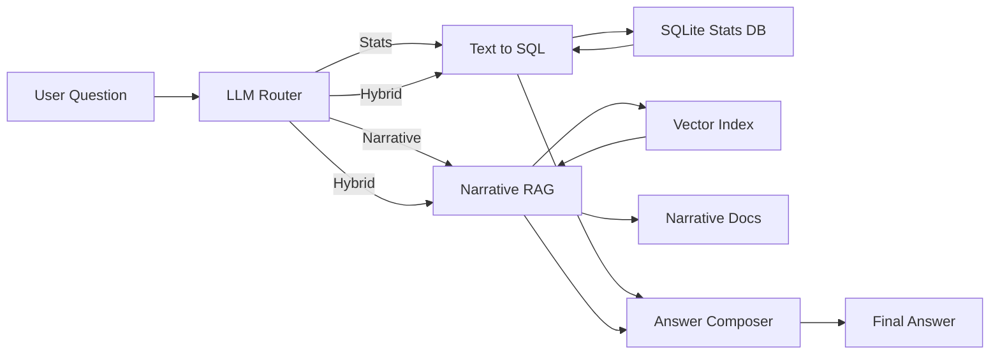

# Hybrid GenAI Assistant: RAG + Natural Language Query

This project demonstrates a modular **GenAI question-answering assistant** that uses a **language model as a dynamic router** to decide which tool to use for a given question.

The assistant can route questions to:

- **Text-to-SQL** for querying structured data (SQLite)
- **Retrieval-Augmented Generation (RAG)** for narrative or historical context
- **A hybrid path** when both structured stats and narrative explanation are useful

The current implementation uses **Philadelphia Eagles NFL data (2020–2025)** as the demonstration domain, but the architecture is intentionally domain-agnostic.

At the core of the system is an **LLM-based router** that:
- Interprets the user’s natural language question
- Classifies intent and extracts entities (player, stat, year, opponent, etc.)
- Selects the appropriate tool: SQL, RAG, or both
- Composes a final answer from the tool outputs

---

## What This Assistant Can Do

### Text-to-SQL (Structured Queries)

- Translates natural language into SQL
- Applies schema-aware prompt constraints
- Executes queries against a local SQLite database
- Returns results as pandas DataFrames

**Example questions:**
- “How many rushing yards did Jalen Hurts have in 2022?”
- “Compare Eagles offensive production in 2023 vs 2024”

### Retrieval-Augmented Generation (Narrative Context)

- Retrieves relevant text chunks from Wikipedia-style documents
- Uses vector similarity search (FAISS)
- Injects retrieved context into the LLM prompt for grounded explanations

**Example questions:**
- “Why did the Eagles lose momentum mid-season in 2024?”
- “What injuries affected the Eagles offense late in the year?”

### LLM-Based Question Router

The router is powered by an LLM rather than hard-coded rules. It:

- Determines whether a question is factual, explanatory, or mixed
- Extracts key entities for downstream tools
- Decides which tool(s) to invoke
- Sends results to a composer that synthesizes the final response

This design makes the system **tool-aware**, **flexible**, and **extensible**.

---

## Architecture Overview

High-level flow:

- User submits a natural language question  
- An **LLM-based router** analyzes the question  
- The router selects one or more tools:  
  - Text-to-SQL for structured stats  
  - RAG for narrative context  
- Tool outputs are passed to an answer composer  
- The system returns a synthesized response combining stats and explanation

---

## Project Structure

`hybrid-genai-assistant-rag-natural-language-query/`

- `agent/`  
  - `router.py` – LLM-based routing logic  
  - `composer.py` – Final answer synthesis  
- `stats/`  
  - `text_to_sql.py` – SQL generation + reflection  
  - `sql_utils.py` – SQLite execution helpers  
- `rag/`  
  - `chunker.py` – Document chunking  
  - `embedder.py` – Embedding generation  
  - `retriever.py` – FAISS vector search  
- `data/`  
  - `stats.sqlite` – Structured Eagles stats  
  - `narratives/` – Text docs  
  - `chunks.jsonl` – Chunked passages  
  - `narrative_index.faiss` – FAISS index  
  - `narrative_metadata.json` – Chunk metadata  
- `paths.py` – Centralized path config  
- `main.py` – Run pipeline  
- `README.md`

---

## Data Overview

### Structured Data

- Eagles player, game, and season-level statistics from nflVerse https://github.com/nflverse.
- Seasons: 2020–2025  
- Stored in SQLite and queried using Text-to-SQL

### Unstructured Data

- Wikipedia-style narrative documents  
- Chunked with overlap  
- Embedded and indexed for semantic retrieval  
- Used exclusively for RAG-based responses

---

## 🛠 Tech Stack

- Python
- SQLite + pandas
- FAISS
- OpenAI-compatible LLM APIs
- VS Code / Google Colab

---

## Author

**Lee Skelton**  

## 📌 Notes

- The **Philadelphia Eagles** are used only as a demonstration domain.
- The architecture is modular, generalizable, and testable across industries.
- Components can be reused, swapped, or extended independently.

---

## ⭐ Why This Project Matters

This assistant demonstrates:

- 🔀 **LLM-as-router** design across structured and unstructured sources  
- 🔧 Integration of **Text-to-SQL and RAG pipelines**  
- 🔍 Focus on **traceability and evaluation**  
- 🚀 A foundation for **agentic, multi-tool GenAI systems**
